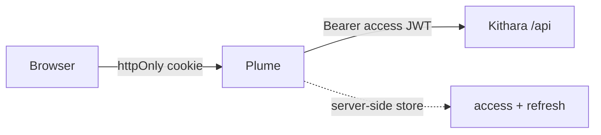
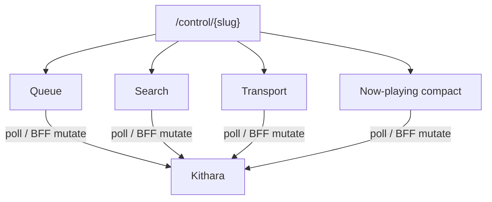
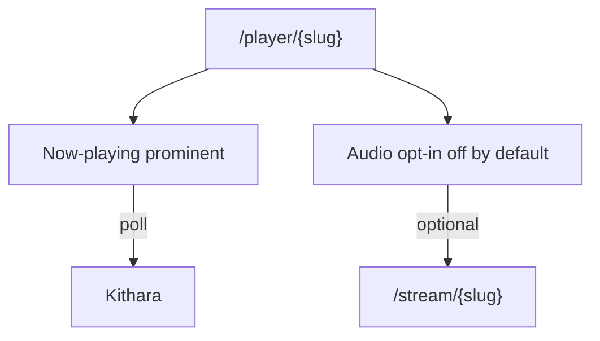

# UI stack

Razor owns the document; Vue mounts **small CSR widgets**; pages compose those widgets on **`/control/{slug}`** (remote desk) and **`/player/{slug}`** (listen surface). No browser JWT — Plume is a **BFF**.

## Document SSR + islands

| Layer | Owns |
|-------|------|
| **Razor Pages** | Full HTML document, auth forms, Struna home, layout chrome |
| **Vue CSR widgets** | Dynamic surfaces only — now-playing, transport, queue, search, optional audio |
| **Tailwind + shadcn-vue** | Styling; Bootstrap is out |
| **Vite** | Bundles island assets for Razor to serve |

The Identity + SQLite + Bootstrap scaffold shipped with the template is **throwaway** — strip it in Plume Phase 1. Plume does not own a user/stream database.

## Pages

| Route | Role | Primary widgets |
|-------|------|-----------------|
| `/` | Home | Mostly Razor — list/create Strunas; auth entry |
| `/control/{slug}` | **Remote control desk** | Queue (main), search, transport; compact now-playing secondary |
| `/player/{slug}` | **Listen / player surface** | Prominent now-playing; optional in-browser audio (**off by default**) |

Do **not** merge player chrome into the control desk as the primary layout. Shared widgets mount on both where useful. There is **no** `/listen` path — ICY stays at `/stream/{slug}`.

## Widget catalog (MVP)

| Widget | Control desk | Player surface |
|--------|--------------|----------------|
| **Now-playing** | Compact secondary | Prominent (YTM/Spotify-style) |
| **Transport** | Primary (play/pause/skip) | Optional |
| **Queue** | Primary | Optional / secondary |
| **Search** | Primary | Optional |
| **Audio** | — | Opt-in to `/stream/{slug}`; starts **off** |

Stay on Razor for discovery login, Struna create/list, and guest code entry unless a tiny widget proves necessary.

## BFF session

<!-- mermaid-source: docs/architecture/diagrams/ui-bff-flow.mmd -->

- Browser holds an **httpOnly** session cookie only — never a JWT in JS.
- Plume stores access/refresh server-side; `/bff/*` (or equivalent) attaches `Authorization: Bearer …` toward Kithara.
- Live MVP: **poll** `now-playing` / queue. Push later is Browser → Kithara events (not a Plume fan-out hub).

## Control desk

<!-- mermaid-source: docs/architecture/diagrams/control-desk-widgets.mmd -->

DJ workbench / guest control. Mutations go through the BFF; widgets poll for freshness.

## Player surface

<!-- mermaid-source: docs/architecture/diagrams/player-surface.mmd -->

Familiar `/player` name for **listening**. External players (VLC, etc.) keep using `/stream/{slug}` directly.

## Explicit non-goals

- `/listen` path
- Nuxt / Vue SSR
- Blazor
- Bootstrap
- Browser JWT
- Plume SignalR / push hub
- One page that is both desk and YTM-style player

**Related:** [01-role-and-boundaries.md](01-role-and-boundaries.md) · [02-contracts.md](02-contracts.md) · [mvp/implementation-plan.md](mvp/implementation-plan.md) · Kithara [uri-routing](https://github.com/Bardie-radio/kithara/blob/main/docs/architecture/interfaces/uri-routing.md)

**Read next:** [mvp/implementation-plan.md](mvp/implementation-plan.md)
