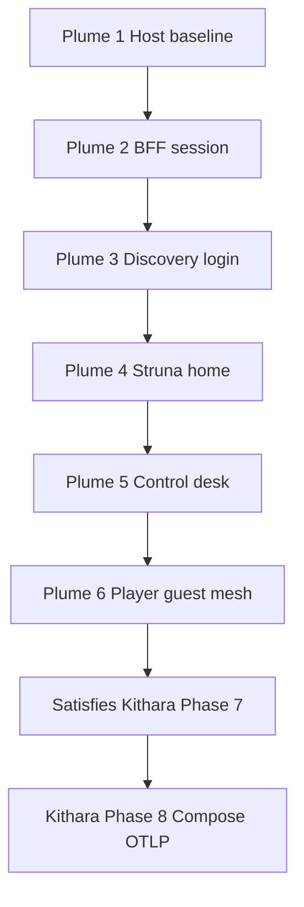

# Plume MVP v0.1 milestones

Delivery order only — no calendar dates. Detail: [implementation-plan.md](implementation-plan.md).

## Ordered milestones

1. **Host baseline** — strip scaffold; Razor + Tailwind/Vite; empty `/`
2. **BFF + session** — httpOnly cookie; server-side tokens; no JWT in browser
3. **Discovery login** — Bes `form_schema` via BFF
4. **Struna home** — list/create; links to control + player
5. **Control desk** — `/control/{slug}`; queue/search/transport; poll
6. **Player, guest, mesh** — `/player/{slug}`; audio off by default; guest; Register; OTel
7. **Kithara Phase 7 exit** — umbrella closed by Plume 1–6 (tracked in kithara plan)
8. **Kithara Phase 8** — Compose + OTLP E2E consumes a finished (or nearly finished) Plume

**Related:** [v0.1-scope.md](v0.1-scope.md) · [implementation-plan.md](implementation-plan.md) · Kithara [v0.1-milestones](https://github.com/Bardie-radio/kithara/blob/main/docs/architecture/mvp/v0.1-milestones.md)

**Read next:** [implementation-plan.md](implementation-plan.md)
